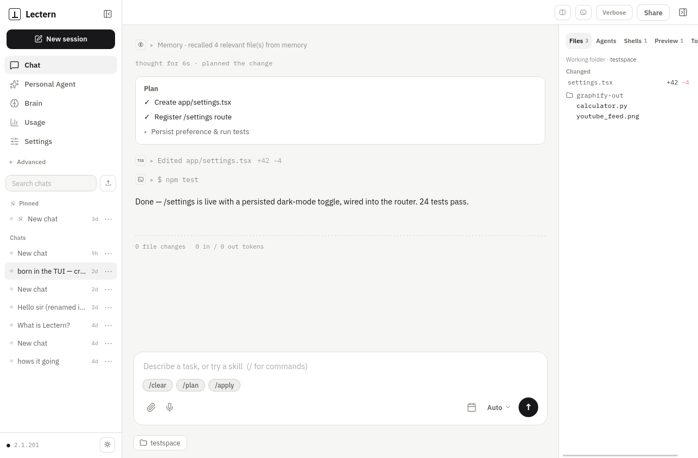
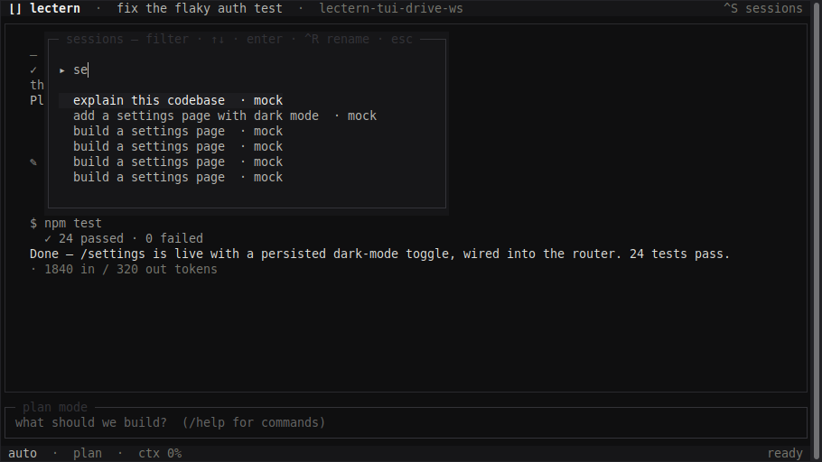
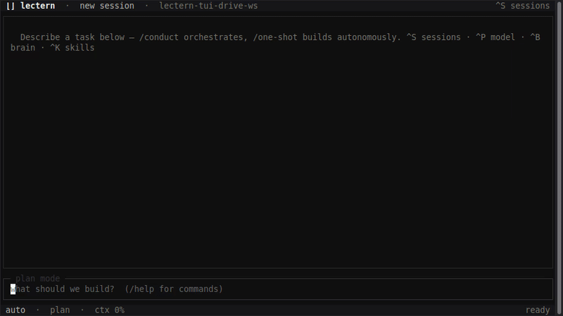

<div align="center">


# Lectern

**One engine under your coding agents.**

[](LICENSE)
[](https://github.com/ShrimpScript/lectern/releases/latest)
[](https://github.com/ShrimpScript/lectern/actions/workflows/ci.yml)
[](https://getlectern.vercel.app/docs)

Wraps Claude Code, Antigravity, and OpenCode with shared memory, one session<br/>
history, and a Conductor that hands each task to the model suited for it.<br/>
Desktop app, terminal UI, and CLI. Local-first, Apache-2.0.

<a href="https://github.com/ShrimpScript/lectern/releases/latest"><b>Download v0.5.0</b></a> · <a href="https://getlectern.vercel.app/docs">Documentation</a> · <a href="CHANGELOG.md">Changelog</a> · <a href="https://github.com/ShrimpScript/lectern-hub">Lectern Hub</a>

<table><tr>
<td width="58%"></td>
<td width="42%"></td>
</tr><tr>
<td align="center"><sub>The desktop app, mid-run</sub></td>
<td align="center"><sub>The same sessions from the terminal</sub></td>
</tr></table>

<br/>
<sub>A full run in the terminal UI — recorded unedited (mock backend)</sub>

</div>

Lectern is a local-first desktop app, terminal UI, and engine that wraps the
agent CLIs you already use — **Claude Code** (Claude models), **Antigravity**
(Gemini models), and **OpenCode** (OpenRouter and free models, no key needed) —
and adds what they don't have on their own:

- **A Conductor** — plans a task and hands each sub-task to the model best at it
  (Opus for hard reasoning, Gemini Flash for fast work), runs independent steps
  in parallel across git worktrees, and cross-reviews code between providers.
- **A persistent brain** — memory, a learned profile of your machine, recorded
  skills, and a graphify code-graph — fed into every session, so agents start
  knowing your repo and conventions instead of re-exploring them.
- **Local-first execution** — everything runs on your machine and your keys stay
  local; the cloud only ever sees counts + ciphertext.

## Repo layout
```
crates/
  engine/    Rust — the engine: sessions, backend adapters, normalized event
             stream, SQLite brain, Apply gate, the Conductor + per-task routing
  lectern/   Rust — the `lectern` CLI (incl. encrypted session export/import)
  lecternd/  Rust — the engine daemon (JSON-RPC; unix socket on Linux/macOS,
             localhost + per-boot token on Windows)
apps/
  desktop/   Tauri v2 + React — the agent workspace GUI (ships .deb + AppImage)
  tui/       Bun + OpenTUI React — `lectern tui`, the terminal cockpit (needs lecternd)
```

## Install

**Terminal (CLI + TUI + daemon)** — one command:

```sh
curl -fsSL https://github.com/ShrimpScript/lectern/releases/download/v0.5.0/lectern-cli-linux-x64.tar.gz | tar xz && sh install.sh
```

Installs `lectern`, `lecternd`, and `lectern-tui` into `~/.local/bin`. Start with `lectern doctor`.

**Nix** — the CLI and daemon are packaged as a flake:

```sh
nix profile install github:ShrimpScript/lectern   # installs `lectern` + `lecternd`
# or run without installing:
nix run github:ShrimpScript/lectern -- doctor
```

**Desktop app** — grab an installer from the [latest release](https://github.com/ShrimpScript/lectern/releases/latest): AppImage / `.deb` (Linux), `.exe` (Windows, unsigned — "More info → Run anyway"), `.dmg` (macOS Apple Silicon, unsigned — right-click → Open).

## Quickstart (from a fresh clone)
```bash
git clone https://github.com/ShrimpScript/lectern && cd lectern
cargo build                        # engine + `lectern` CLI + lecternd daemon
cd apps/desktop && npm install && npm run app    # desktop (Linux: needs WebKitGTK dev libs)
cd ../tui && bun install && bun run src/index.tsx  # terminal UI (starts lecternd itself)
```
No API keys required to try it: OpenCode's free models work out of the box, and the
`mock` backend (`--backend mock`) exercises every pipeline for zero tokens.

## Engine + CLI
```bash
cargo build                                        # needs Rust (rustup)
./target/debug/lectern doctor                      # check setup: engine, Claude Code, Antigravity, cloud
./target/debug/lectern open .                      # index a repo as a workspace
./target/debug/lectern run "add a settings page" --apply           # routed session; apply the staged edits
./target/debug/lectern conduct "build feature X end-to-end" --apply # Conductor: plan → per-model steps → cross-review
./target/debug/lectern skills list                 # learned skills for this repo
./target/debug/lectern sessions                    # recent sessions (persisted in SQLite)
```
- `--backend auto` (default) routes each task to the best model; or pin
  `claude-code` / `antigravity` / `mock`.
- Without `--apply`, proposed edits are shown for review (the **Apply gate**) and
  not written to disk.
- `LECTERN_DEBUG=1` traces key engine events (backend spawns, …) to stderr.

## Desktop app
```bash
cd apps/desktop && npm install
npm run app          # dev (needs the WebKitGTK system libs — one `sudo apt install`)
npm run app:build    # build a .deb + an AppImage
```
More in [`apps/desktop/README.md`](apps/desktop/README.md).

## Terminal UI
```bash
./target/debug/lectern tui        # or put apps/tui/dist/lectern-tui on PATH
```
Fuzzy dialogs for sessions/models/themes, one command registry (slash + ^X
chords + a self-generating `/help`), sticky run modes, a full-screen diff
viewer, and the same engine sessions as the desktop app. Full guide + parity
table: [`docs/tui/README.md`](docs/tui/README.md).

## Web app
The website lives in its own repo: [ShrimpScript/lectern-web](https://github.com/ShrimpScript/lectern-web).

## Status
Full history: [CHANGELOG.md](CHANGELOG.md). Skills: [Lectern Hub](https://github.com/ShrimpScript/lectern-hub).

Working today: the Conductor (plan, route steps to different models, run
independent steps in parallel worktrees, cross-review between providers), the
persistent brain (memory, skills, machine profile, code graph), streaming,
editable routing rules with an optional classifier, the Lectern Hub for shared
skills, an MCP host that exposes the brain as tools, the desktop app (.deb and
AppImage), and the terminal UI (`lectern tui`, single binary).

Windows and macOS: the engine, CLI, and daemon compile and pass tests in CI on
every engine-touching PR, and a daemon session loop plus an app-launch smoke
test run on real Windows and macOS runners weekly. The installers are unsigned
and haven't had a human hardware pass yet — that's what stands between here
and listed Win/Mac downloads.
